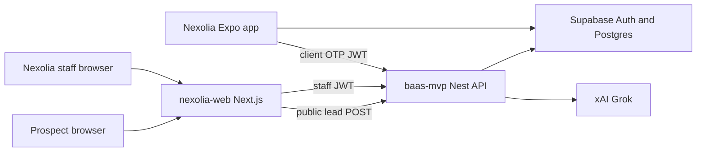
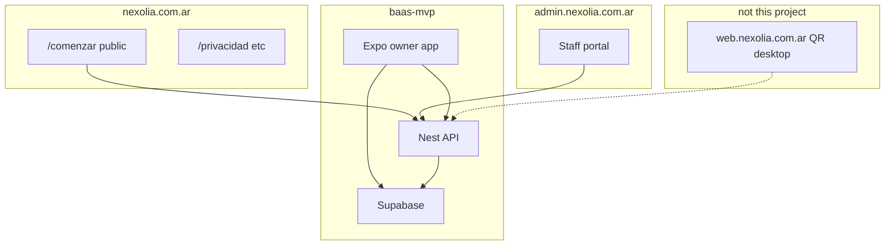
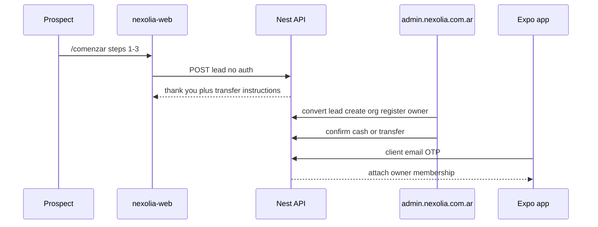
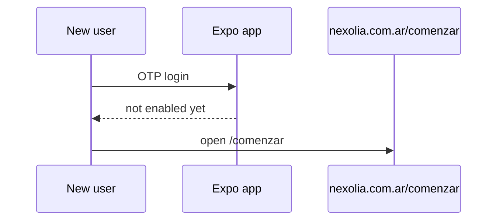

# Nexolia Web — Architecture

Public onboarding at **nexolia.com.ar** and staff portal at **admin.nexolia.com.ar** share the `nexolia-web` Next.js app (host-based routing). Business logic stays in `baas-mvp` (Nest API + Supabase). The desktop QR product at `web.nexolia.com.ar` is a separate repo.

## Tech stack

| Layer | Choice | Notes |
| --- | --- | --- |
| App | Next.js App Router, TypeScript, Tailwind | Replaces static `server.mjs` |
| Hosting | Railway | Apex + `admin.nexolia.com.ar` (Cloudflare DNS) |
| Brand | Navy `#101935`, green `#08bd66` | Design system tokens |
| Staff auth | Supabase email/password (`nexolia_staff` / invites); Google OAuth later |
| Client auth | Not on this site (v1) | Mobile OTP in baas-mvp |
| API | NestJS in baas-mvp | `/admin/*`, public lead POST |
| Data | Same Supabase as the app | RLS for clients; service-role in Nest admin |
| AI | xAI Grok via Nest | Browser never holds `XAI_API_KEY` |
| Not this repo | Expo, Nest process, `nexolia-webapp` | — |

## System context

## Surfaces

## Lead → staff convert → app attach

## Unprovisioned app user

## Epic

[KAN-405](https://souviksamanta.atlassian.net/browse/KAN-405) — Admin portal + client onboarding
